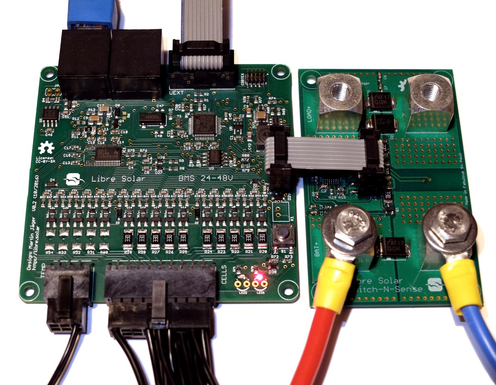

# 24V/36V/48V Battery Management System

 Prototype built, development ongoing (major issues might still be open).

Battery management system for up to 15 Li-ion cells based on bq76940 or bq76930 IC from Texas Instruments

The Libre Solar BMS is divided into two different boards:

- Control board (BMS48V)
- Power board (Switch-N-Sense)

A picture of the current version is shown below:

On the bottom of the control board (left side), the cells are connected for balancing and voltage monitoring. In addition to that, up to three temperature sensors (10k thermistors) can be connected to the board. The board features a CAN interface through two daisy-chained RJ-45 connectors. Via the universal UEXT connector, additional peripherals can be connected via SPI, I2C or USART.

The Switch-N-Sense board acts as the interface between the Li-ion battery and the outside world. It contains the sense resistors for current measurement and charge/discharge MOSFETs at the bottom side. For improved cooling, it can be attached to a cooling plate. The wire-to-board connection is done via Würth Power Element press-fit connectors, allowing very high currents.

The two boards are separated in order to adjust the power part depending on your actual needs. If you only need to deliver low currents from the battery, the Switch-N-Sense board can be smaller and cheaper.

Please find a good description about system integration of the BMS in the [Open Source Ecology Wiki](https://wiki.opensourceecology.de/24-48V_BMS) (in German).

## Features

- Up to 15 Li-ion cells (e.g. LiFePO4)
- MCU: STM32F072 (ARM Cortex M0)
- CAN communication inteface
- UEXT connector for feature extension
- Current depending on externan Switch-N-Sense board (current design: 80A for <60V)
- FDMT80080DC as CHG and DSG FETs (same as new SBMS100 from Dacian Todea)
- High-side switches using new TI BQ76200 --> no problems with ground offsets for CAN communiction etc. anymore.
- Possibility of pre-charging the 48V bus before switching on the battery.
- Balancing current approx. 150 mA

## Development

This BMS was still developed with Eagle. We are currently working on the next generation based on the TI BQ76952 for up to 16 cells. As for all new designs, it will be developed with KiCad.

For schematics and board layout of the existing design visit the GitHub repository [LibreSolar/bms-15s80-sc](https://github.com/LibreSolar/BMS-15S80-SC "12V/48V Battery Management System").
