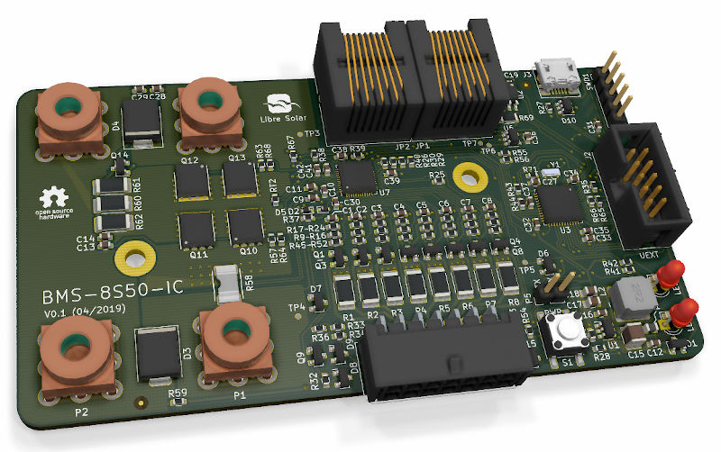

# 12V/24V Battery Management System

 First boards tested, some issues might still be open.

Battery management system for up to 8 Li-ion cells based on Intersil ISL94202 IC.

## Features

- 3 to 8 Li-ion cells (e.g. LiFePO4)
- Integrated high-side MOSFET switch and current sensor
- Balancing current approx. 150 mA
- STM32L452 ARM microcontroller
- Built-in CAN communication interface and UEXT extension connector

## Development

The BMS is under active development and you are welcome to participate.

Visit the [GitHub page](https://github.com/LibreSolar/bms-8s50-ic) for schematics and board layout.

