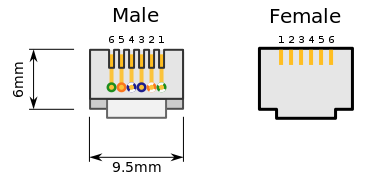

# LS.one UART serial communication interface

The LS.one interface allows a single serial connection between a device (e.g. charge controller) and a host (e.g. display or computer), hence the name one. It is mainly used in charge controllers or other devices that are intended to be used as stand-alone units.

The following functions can be fulfilled with the interface:

- Device configuration and monitoring via ThingSet protocol
- Remote temperature sensor connection
- Remote switch connection
- Display interface

## Connector and pinout

For connection to the device, a 6P6C modular jack is used, also known as RJ25 or RJ12.

*(Image adapted from [Wikipedia](https://commons.wikimedia.org/wiki/File:RJ-25_plug_and_jack.svg), CC-BY-SA license)*

The following pinout is used on the device side:

| Pin # | Name | Description |
|-------|------|-------------|
| 1     | 3V3  | 3.3V power supply (optional) |
| 2     | RX   | UART receive pin at device (max. 3.3V) |
| 3     | TX   | UART transmit pin at device (max. 3.3V) |
| 4     | GND  | Ground reference (mandatory) |
| 5     | NTC  | 10k NTC thermistor (other end connected to GND) |
| 6     | BTN  | Remote push-button signal (other end connected to GND) |

The UART interface is not expected to be galvanically isolated on the device side. If the host side is not battery-powered and has an additional connection the energy system ground (e.g. because it is powered via the load output of a charge controller), special care must be taken and an optical isolator chip is recommended on the host interface.

The optional power supply via pin 1 can be used to supply host devices like LC displays with a low-power microcontroller. Minimum power requirement is around 20 mA (t.b.d.).

In addition to the UART communication interface, the port can be used to connect an external thermistor at pin 5, e.g. for battery temperature measurement. Pin 6 can be used for an external push-button signal.

**Rationale for the pinout:** The 6P2C wires with pins 3 and 4 only (as used in telephones) are probably most widely available worldwide. With these two pins it is possible to use the port for data logging (only TX and GND needed). Bi-directional communication and remote temperature sensing is possible with 6P4C wires. Only devices that require power supply or the remote button (e.g. a display) need all 6 wires.

## Example 1: WiFi interface with ESP8266 or ESP32

The RX/TX wires have to be crossed to connect to the host device (here a wifi module based on ESP8266 or ESP32).

As the power supply provided by the LS.one port is not sufficient for the current peaks generated by wifi modules, the module has to be powered externally.

## Example 2: External temperature sensor

Connect one wire of the NTC to GND, the other to the NTC pin. The devices expect a 10k NTC. Other types of NTCs will lead to false measurement values.

## Example 3: External push-button

The BTN pin must be pulled up inside the device, so that the button can be just a mechanical switch connected between BTN pin and GND.

