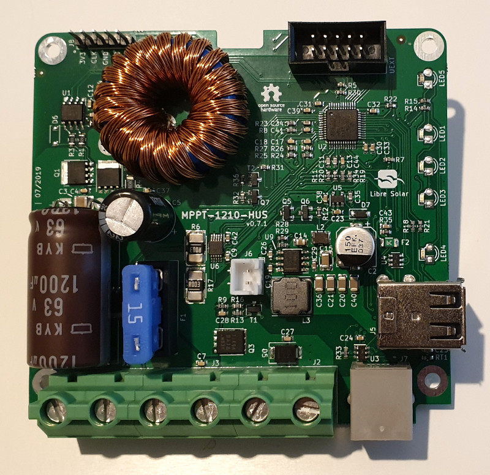

# MPPT charger (10A) with dual USB output

 Tested prototype, evaluation boards available.

This charge controller is based on the [20A MPPT](/devices/mppt-charger-20a/), but has reduced number of components and cheaper DC/DC power stage for 10A.

The power is sufficient for small 12V applications with up to 150 W solar panels.

With the integrated dual USB output you can directly charge your mobile phone or power other devices such as Raspberry Pi.

## Buy development board

You can buy a fully assembled board as shown in the picture above. It uses SMD LEDs which can be replaced by THT LEDs depending on the application.

The board comes without a housing. Suitable CAD files for 3D printing can be found [here](https://github.com/LibreSolar/charge-controller-housings/tree/master/MPPT-PWM-xUS).

Please check the [GitHub repository](https://github.com/LibreSolar/MPPT-1210-HUS) for full technical details and a manual.

**Important:** This is a development board for evaluation and requires expert knowledge to use it, including flashing [the firmware](https://github.com/LibreSolar/charge-controller-firmware). It is not a product for normal end users, yet.

<form action="https://www.paypal.com/cgi-bin/webscr" method="post" target="_top">
<input type="hidden" name="cmd" value="_s-xclick">
<input type="hidden" name="hosted_button_id" value="5MF9M5MVDQZ4L">
<input type="image" src="https://www.paypalobjects.com/de_DE/DE/i/btn/btn_buynowCC_LG.gif" border="0" name="submit" alt="Jetzt einfach, schnell und sicher online bezahlen – mit PayPal.">

</form>

**Please note:** Due to COVID-19 a worldwide shipment is not possible at the moment, so we can only offer shipping inside the Europe. If you want shipping outside Europe, please [get in contact](https://libre.solar/about/contact/) first to check possible options.

## Features

- Maximum Power Point Tracking (MPPT)
- 12V nominal battery voltage
- 10A max. charging current
- 40V max. solar input (36 to 48-cell panels, ideally so-called 12V panels with 36 cells)
- Ultra low-power 32bit ARM MCU (STM32L072)
- Dual USB charging ports
- Expandable via Olimex Universal Extension Connector (UEXT) featuring I2C, Serial and SPI interface (e.g. used for display, WIFI communication, etc.)
- Built-in protection:
  - Overvoltage
  - Undervoltage
  - Overcurrent
  - PV short circuit
  - PV reverse polarity
  - Battery reverse polarity (destructive, fuse is blown)

## Development

The charge controller is under active development and you are welcome to participate.

Visit the [GitHub page](https://github.com/LibreSolar/MPPT-1210-HUS "10A MPPT Solar Charge Controller with USB output") for schematics and board layout.
