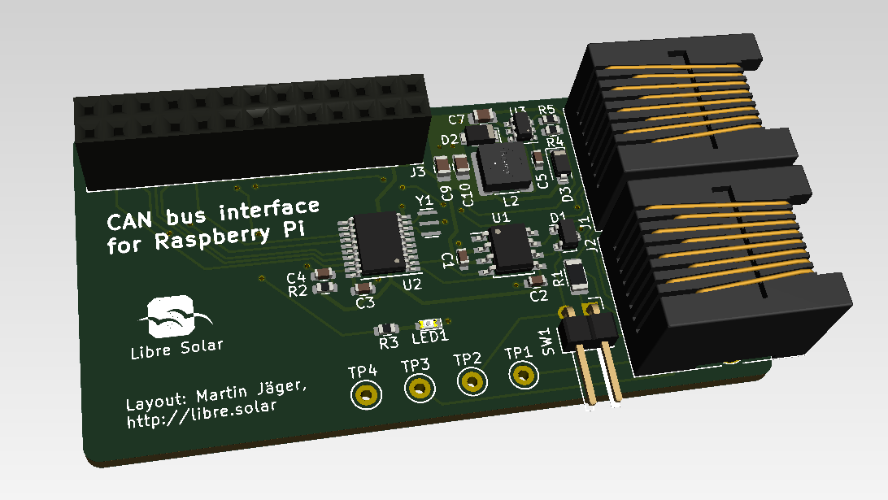

# CAN interface for Raspberry Pi (Zero W)

 Tested prototype, only minor issues left.

This interface PCB allows to read data from the CAN bus connecting the Libre Solar components. So the Raspberry Pi can be used as a gateway to IoT applications and energy monitoring (e.g. using Open Energy Monitor).

The pin header is compatible with all Raspberry Pi models, but the size is especially suited for the Raspberry Pi Zero W.

## Features

- CAN interface via SPI using MCP2515 controller and TJA1042T/3 transceiver
- Power supply of Raspberry Pi via bus connector (RJ45)
- CAN transceiver standby connected to GPIO 24 (low power consumption mode possible)
- LED on GPIO 22 for custom status information

## Further information

Visit the [GitHub page](https://github.com/LibreSolar/CAN_RPi-ZeroW "Libre Solar CAN interface for Raspberry Pi (Zero W)") for useage instructions, schematics and board layout.
