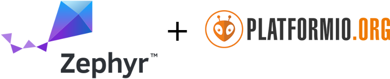

# Firmware and Software

We are using state-of-the-art [Zephyr RTOS](https://www.zephyrproject.org/) for most of our firmware, combined with [PlatformIO](https://platformio.org/) to make it easily accessible even for beginners.

These are the some of the key advantages of Zephyr compared to other embedded operating systems:

- Excellent build system and customization (based on Devicetree and Kconfig from Linux kernel) that allows a clear separation between board specification and the firmware itself.
- Great community and open governance, so it’s a truly community-driven open source project.
- Strong focus on code quality, security and safety (aiming towards ISO 26262 and IEC 61508 certification)

Libre Solar is also actively contributing to upstream Zephyr.

Devices based on ESP32 are currently programmed using the [ESP-IDF](https://github.com/espressif/esp-idf), as full Zephyr support for ESP32 is still [work in progress](https://github.com/zephyrproject-rtos/zephyr/issues/29394). A switch to Zephyr is a very likely option for the future.

## Further information

The C/C++ coding style for our firmware development is described [here](https://github.com/LibreSolar/coding-style).
