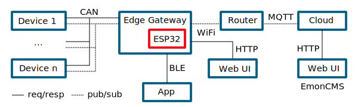
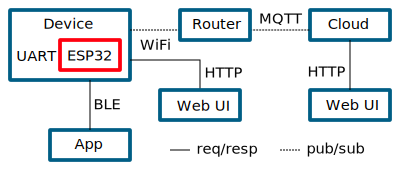

# ESP32 Edge Firmware

Firmware for CAN and UART to WiFi or Bluetooth gateway based on ESP32-IDF.

GitHub repository: [LibreSolar/esp32-edge-firmware](https://github.com/LibreSolar/esp32-edge-firmware)

## Concept Overview

The firmware supports multiple use-cases to connect devices implementing the [ThingSet Protocol](thingset.md) with other networks like the internet.

### ESP32 acting as an Edge Gateway to the cloud

In this application, the ESP32 is integrated in a separate device (like the Libre Solar [Data Manager](https://github.com/LibreSolar/data-manager)) and communicates with the other devices like the charge controller via CAN bus.

The ThingSet protocol on the CAN bus can translated to MQTT in order to push data to a cloud. For local access, the ESP32 can directly serve a website or provide a Bluetooth Low Energy interface for a mobile phone app.

### ESP32 integrated in device (e.g. charge controller)

The ESP32 board can also be directly integrated in a charge controller or other devices and communicate with the host device via UART interface (again using the ThingSet protocol).

The data can be accessed in the same way as described above.

## Firmware features

- Written in C using ESP-IDF and PlatformIO
- Data input from Libre Solar devices via
    - [LS.bus](ls-bus.md) (CAN bus)
    - [LS.one](ls-one.md) (UART serial)
- Local communication via [ThingSet Protocol](thingset.md)
- Data access via HTTP JSON API
- Publishing of monitoring data via WiFi to
    - Open Energy Monitor [Emoncms](https://emoncms.org/)
    - MQTT broker
- Data logging on SD card (ToDo)
- Bluetooth interface (ToDo)
