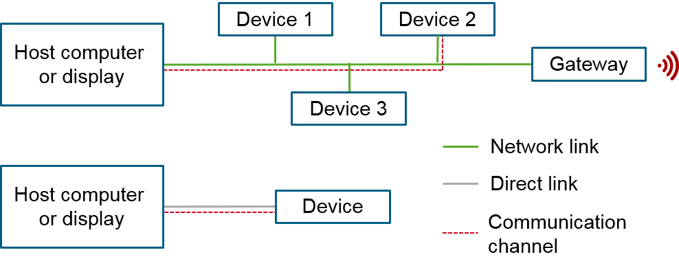

# ThingSet Protocol

The ThingSet protocol provides a consistent, standardized way to configure, monitor and control ressource-constrained devices via different communication interfaces. The application layer protocol is widely independent of the underlying transport protocols and physical interfaces (e.g. CAN, USB, WiFi, Bluetooth or a simple serial interface).

The underlying layers have to ensure reliable transfer, correct packet order (if messages are packetized) and error-checking of the transferred data.

Two devices communicate via so-called channels. A communication channel can be established either directly (e.g. serial interface, USB, Bluetooth) or via a network or bus with several devices attached (e.g. CAN, Ethernet, WiFi, LoRa). In case of a network, each device/node has to be uniquely addressable.

The device acts as the server and responds to the requests by a client. The client might be a laptop or mobile phone with a human interface application.

The data transfer is always synchronous: The client sends a request, waits for the response (status code and/or requested data), handles the data of the response and possibly starts with additional requests.

Monitoring data is not intended for only a single device, but could be interesting for several devices (e.g. data logger, display, human interface device, etc.). Thus, the monitoring data is exchanged via a publish/subscribe messaging pattern.

Publication messages are directly broadcast through the network. There is *no* intermediate broker (like in MQTT) to store the messages and published messages are *not* confirmed by recipients, so there is no guarantee if the message was received.

## Specification and ongoing development

The ThingSet protocol is under active development. Visit the [thingset.github.io](https://thingset.github.io) for further information.
