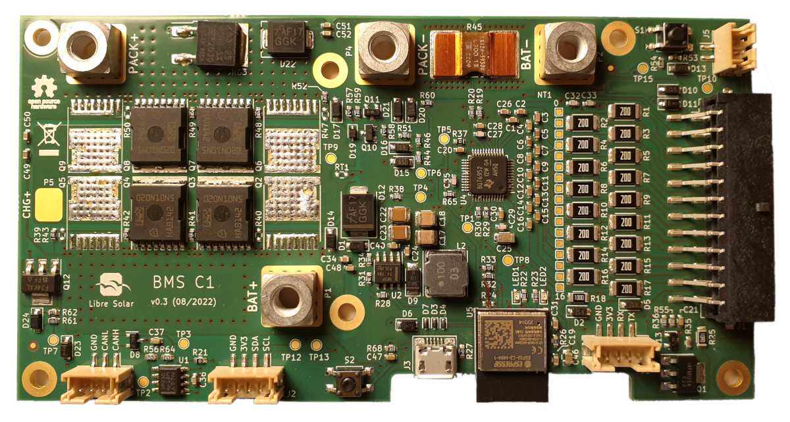

# BMS C1

 Prototype built, development ongoing (some issues might still be open).

The Libre Solar BMS C1 is our newest and most modern battery management system board. The development of this BMS is funded by the [EnAccess foundation](https://enaccess.org).

**Remark:** This BMS was previously named **BMS 16S100 SC**. It was renamed to C1 (with C for compact/centralized) because the maximum current and supported number of cells depend on the parts actually populated on the PCB, so these specs should not be encoded in the PCB name.

## Features

- 3 to 16 Li-ion cells in series
- Continuous current: 70-100A (depending on used MOSFETs and heat sink)
- Cell types: LiFePO4, Li-ion NMC and others (customizable)
- Measurements
  - Cell voltages
  - Pack voltage
  - Pack current
  - Pack (2x) and MOSFET temperatures
- Based on Texas Instruments bq76952
- Integrated high-side MOSFET switch and current sensor
- Espressif ESP32-C3 microcontroller
- Communication interfaces:
  - CAN
  - USB (CDC-ACM and JTAG)
  - USART
  - I2C
  - Bluetooth Low Energy
  - WiFi
- Hardware features
  - 4-layer PCB
  - M5 screw terminals
  - Heat sink at back side
- Applications
  - Off-grid storage
  - Light-electric vehicles (LEV)

## Development

The BMS is under active development and you are welcome to participate.

Visit the GitHub repository [LibreSolar/bms-c1](https://github.com/LibreSolar/bms-c1) for schematics and board layout.

## Firmware

The firmware is developed in a separate repository [LibreSolar/bms-firmware](https://github.com/LibreSolar/bms-firmware).
