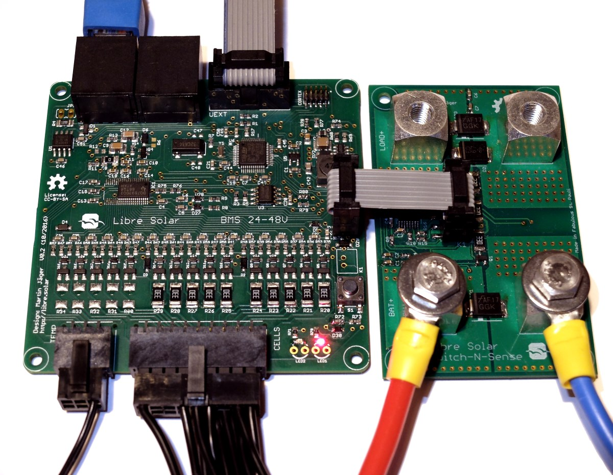

# Inactive BMS Designs

Similar to [inactive charge controller designs](cc-inactive.md), also some of the previous Libre Solar BMS hardware is not actively developed anymore.

## BMS 5S50 SC

GitHub repository: [LibreSolar/bms-5s50-sc](https://github.com/LibreSolar/bms-5s50-sc)

This battery management system for up to 5 Li-ion cells is based on bq76920 IC from Texas Instruments. It has separate stacked boards for control and power.

As the 5s chip allows to build only 12V batteries, the newer [BMS 8s50 IC](bms-8s50-ic.md) was developed using the ISL94202 to support 12V and 24V systems. The new design also reduces cost because power and control circuit share the same board.

## BMS 15S80 SC

GitHub repository: [LibreSolar/bms-15s80-sc](https://github.com/LibreSolar/bms-15s80-sc "12V/48V Battery Management System")

Battery management system for up to 15 Li-ion cells based on bq76940 or bq76930 IC from Texas Instruments, divided into two different boards:

- Control board (BMS48V)
- Power board (Switch-N-Sense)

On the bottom of the control board (left side), the cells are connected for balancing and voltage monitoring. In addition to that, up to three temperature sensors (10k thermistors) can be connected to the board. The board features a CAN interface through two daisy-chained RJ-45 connectors. Via the universal UEXT connector, additional peripherals can be connected via SPI, I2C or USART.

The Switch-N-Sense board acts as the interface between the Li-ion battery and the outside world. It contains the sense resistors for current measurement and charge/discharge MOSFETs at the bottom side. For improved cooling, it can be attached to a cooling plate. The wire-to-board connection is done via Würth Power Element press-fit connectors, allowing very high currents.

The two boards are separated in order to adjust the power part depending on your actual needs. If you only need to deliver low currents from the battery, the Switch-N-Sense board can be smaller and cheaper.

Please find a good description about system integration of the BMS in the [Open Source Ecology Wiki](https://wiki.opensourceecology.de/24-48V_BMS) (in German).
