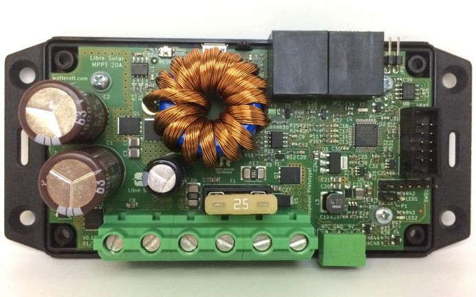

# Inactive Charge Controller Designs

As an open source project we follow the [Release Early, Release Often](https://en.wikipedia.org/wiki/Release_early,_release_often) paradigm. This means that also PCB designs are improved frequently.

In most cases this is more an evolutionary process. But if new innovations and ideas require breaking changes, an older design may become inactive.

**Inactive does not mean obsolete.** You can still continue to use existing hardware based on previous designs. We also try to maintain firmware support for older hardware as long as possible, so that you can still benefit from recent updates and new features.

Currently inactive charge controller designs are listed below.

## MPPT 2420 LC

GitHub repository: [LibreSolar/mppt-2420-lc](https://github.com/LibreSolar/mppt-2420-lc "20A MPPT Solar Charge Controller")

This was one of the first charge controllers developed by Libre Solar and it was the basis for current designs.

The successor [MPPT 2420 HC](mppt-2420-hc.md) has a more powerful MCU, a high-side load switch and improved thermal management.
