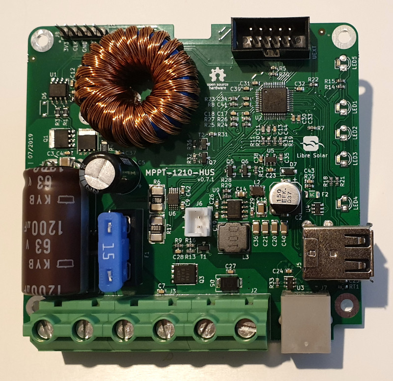

# MPPT 1210 HUS - Battery & USB Charger

 Tested prototype, evaluation boards available.

This charge controller is based on the [20A MPPT](/hardware/cc-inactive#mppt-2420-lc), but has reduced number of components and cheaper DC/DC power stage for 10A.

The power is sufficient for small 12V applications with up to 150 W solar panels.

With the integrated dual USB output you can directly charge your mobile phone or power other devices such as Raspberry Pi.

## Features

- Maximum Power Point Tracking (MPPT)
- 12V nominal battery voltage
- 10A max. charging current
- 40V max. solar input (36 to 48-cell panels, ideally so-called 12V panels with 36 cells)
- Ultra low-power 32bit ARM MCU (STM32L072)
- Dual USB charging ports
- Expandable via Olimex Universal Extension Connector (UEXT) featuring I2C, Serial and SPI interface (e.g. used for display, WIFI communication, etc.)
- Built-in protection:
  - Overvoltage
  - Undervoltage
  - Overcurrent
  - PV short circuit
  - PV reverse polarity
  - Battery reverse polarity (destructive, fuse is blown)

## Development

The charge controller is under active development and you are welcome to participate.

Visit the [GitHub page](https://github.com/LibreSolar/MPPT-1210-HUS "10A MPPT Solar Charge Controller with USB output") for schematics and board layout.
