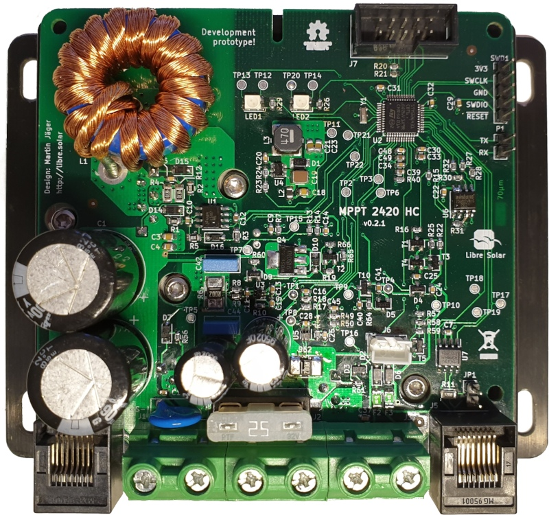

# MPPT 2420 HC - Hackable Charge Controller

 Tested prototype, evaluation phase ongoing.

The Libre Solar project started with the development of a flexible and hackable MPPT charge controller. After a few prototypes using Arduino boards and AVR 8-bit microcontrollers, the current designs are based on 32-bit STM32 ARM MCU with lots of free computing power to allow your own additions in software and communication features.

## Unique features

There are lots of charge controllers on the market. So you might ask yourself why this one is special?

### Extensible hardware

The PCB of the Libre Solar charge controller contains lots of interfaces which could be useful for applications not yet thought about. Especially the [UEXT connector](https://en.wikipedia.org/wiki/UEXT) is useful to add features like displays, wireless communication, etc.

### Creativity by software

Though the primary function of the charge controller is to charge a battery using solar panels, the hardware behind the charge controller is just a high-power DC/DC buck converter. With some tiny software changes it can be used for numerous other applications.

Some examples:

- Small wind turbines with AC generators can be easily connected to the charge controller using some diodes for rectification. Now you can develop a Maximum Power Point Tracking algorithm for your wind turbine.

- As a synchronous buck converter, the DCDC power stage can be changed into a boost converter by software. In this case, current flow goes from the battery output to the solar input. This feature can be used to charge an electric bike battery pack with 36V nominal voltage using a 12V solar pannel. Sounds strange, but works and has been tested already. The 5V output is needed to switch on the bicycle battery (e.g. Bosch or Specialized).

### Fully Open Source

Software and hardware are fully open source and can be used even for commercial applications. You are free to change whatever you want as long as you publish your changes and contribute to the open source hardware community.

## Hard facts

If you want to know the core specifications...

- Maximum Power Point Tracking (MPPT)
- 12V or 24V battery output
- 20A peak charging current
- 80V max PV input
- 32-bit ARM MCU (STM32G431)
- CAN communication interface with standard RJ45 jacks (CANopen-compatible pinout)
- Expandable via Olimex Universal Extension Connector (UEXT) featuring I2C, Serial and SPI interface (e.g. used for display, WIFI communication, etc.)
- Built-in protection:
  - Overvoltage
  - Undervoltage
  - Overcurrent
  - PV short circuit
  - PV reverse polarity (for max. module open circuit voltage of around 70V)
  - Battery reverse polarity (destructive, fuse is blown)

## Development

The charge controller is under active development and you are welcome to participate.

Visit the GitHub repository [LibreSolar/mppt-2420-hc](https://github.com/LibreSolar/mppt-2420-hc "20A MPPT Solar Charge Controller") for schematics and board layout.
