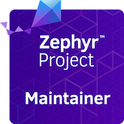
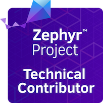
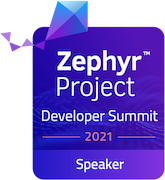
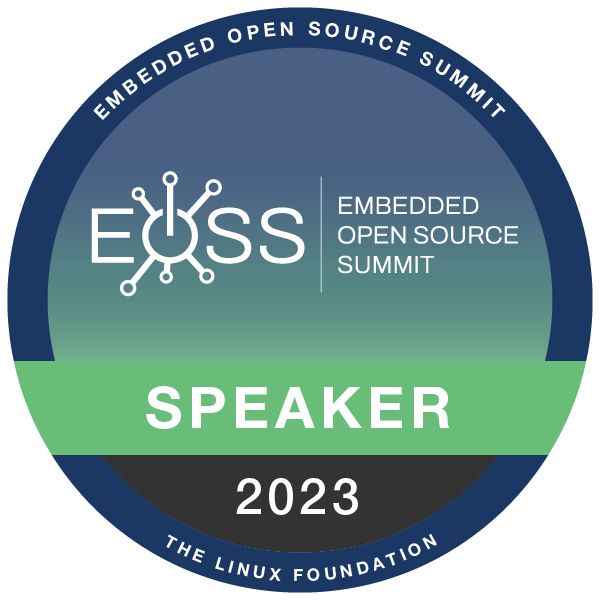

# Support

## Community Support

The development of the Libre Solar software and hardware takes place on GitHub. For this reason, issues in the correct repository are the preferred way to ask questions or suggest improvements. If you implemented an improvement already, you can send a pull-request, which will be reviewed and possibly merged with the existing code or hardware files.

Libre Solar GitHub page: [github.com/LibreSolar](https://github.com/LibreSolar)

Please be aware that technical questions cannot be answered by email because of limited resources and because answers in e-mails are not visible to other people.

## Commercial Support

If you like to develop a product based on Libre Solar firmware or hardware and need development support, please [get in contact with us](mailto:info@libre.solar).

We also offer generic **Engineering and Development services** in the areas of IoT, Hardware & Firmware, Cloud, App and Web through our partner company [A Labs](https://a-labs.io):

  

## Zephyr RTOS Support

Libre Solar is a regular contributor to the [Zephyr RTOS](https://github.com/zephyrproject-rtos/zephyr).

Our founder (Martin Jäger) is maintainer of the **DAC driver** and the **Task Watchdog** subsystem. In addition to that, we are involved in the LoRaWAN development and in industrial communication like the CAN bus and ISO-TP to bridge the gap between traditional protocols and IoT.

  
  

If you need support with your Zephyr-based project, [just send us an e-mail](mailto:info@libre.solar).

### Talks and Conferences

At the Zephyr Developer Summit 2021 we have organized the [Power Electronics Mini-Summit](https://www.youtube.com/watch?v=9XKQqPuZh9w) where we had a presentation about **IoT-enabled Solar Power Converters with Zephyr**. We have also had a talk about using [Zephyr with ThingSet](https://www.youtube.com/watch?v=utQmthcL3ZM&ab_channel=TheLinuxFoundation) at the Zephyr Developer Summit 2023 (as part of the Embedded Open Source Summit).

  
  

